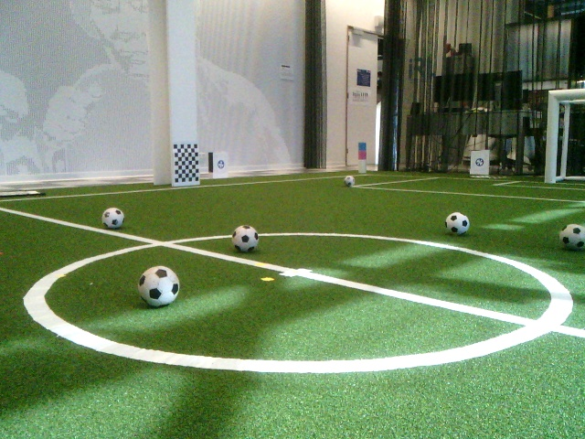
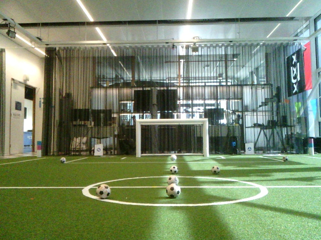
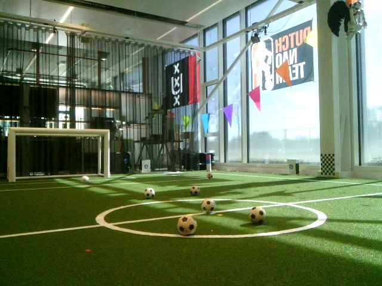
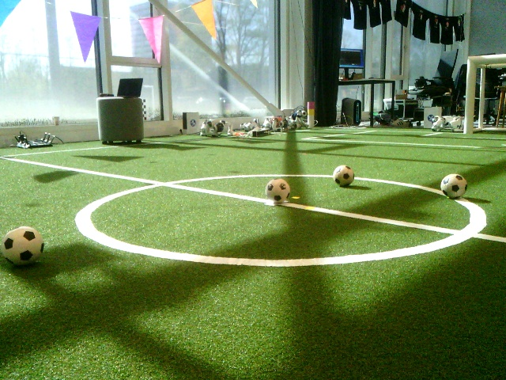
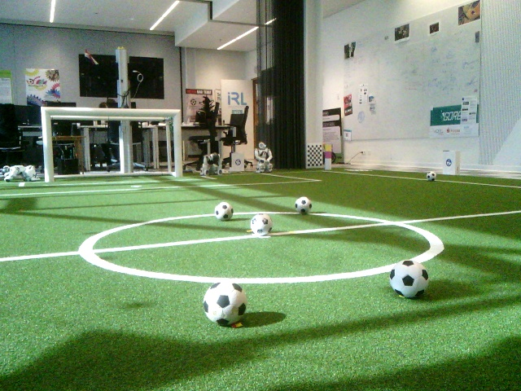
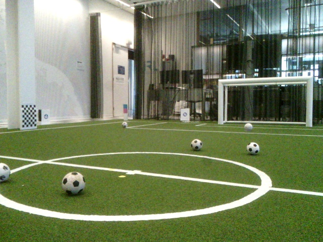
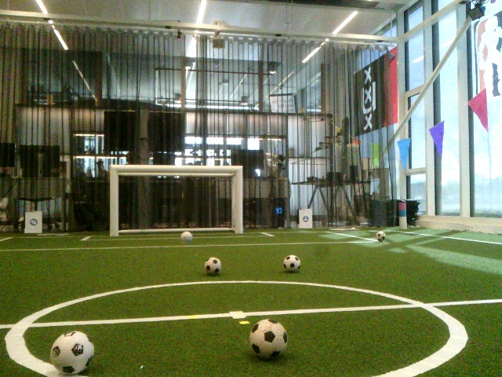
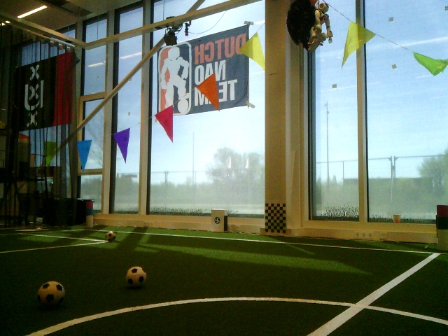
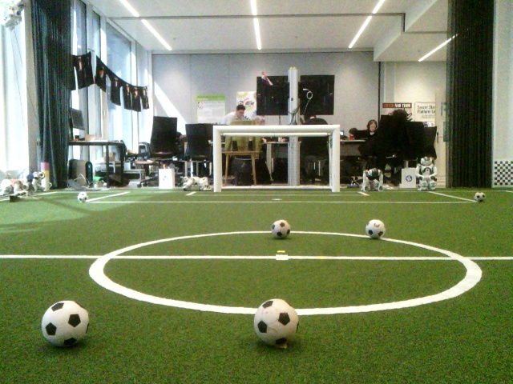
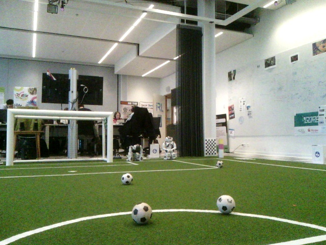

# landmark_based_slam_dataset

Most of the recent SLAM datasets directly start with many observations and many features to recognize in each observation. Yet, it all started with observing a few landmarks in a few observations.

A good example is the Gutmann dataset [1], which used an Aibo robot walking a trajectory between 5 points, observing 6 landmarks on the corner of a soccer field. This experiment was later the origin of the RoboCup 4-Legged league SLAM challenge in 2004 and 2005.
This dataset is a recreation of these experiments, but now with a Nao robot, on a much larger Standard Platform League soccer field.

## RoboCup 2005 SLAM challenge

The locations of the  RoboCup 2005 SLAM challenge consisted of the following five points on a Soccer field of 6 x 4m: [(130,120), (220, -150), (-160,-120), (-210,90), (270,0)] - all cm from the origin at the center of the field. 

  
 <i>RoboCup 2005 SLAM challenge setup, Fig. 2 from [Technical Challenges for the RoboCup 2005 Legged League Competition](https://spl.robocup.org/wp-content/uploads/downloads/Challenges2005.pdf)</i>

 ### Observations

The locations were selected from the RoboCup 2005 SLAM challenge, but the orientation was chosen that when possible the center circle was visible. The location of the Aibo landmarks is as defined by Gutmann, but scaled up to the current soccer field. Note that the Optitrack uses a different coordinate system, so the sign of the y-values have to be swapped. The orientation around the z-axis also have to be mirrored.

#### Point 1 - (130,120)

  
<i>Orientation &pm; -135 degrees, towards the Blue goal. Only one goal-post is visible, the center circle, two NaoMarks. In the corner the blue-magneta landmark.</i>

The [OptiTrack recording](./black1/point1/1blackTake%202024-04-10%2003.24.49%20PM.csv) shows for frame 1152 the following line (9.6 sec after the start of the recording), which indicates a location of (1.296, -1.217)m and -5.49 deg: 
<tt>1152,9.600000,-8.105729,-6.102250,-5.494285,1.295658,0.460063,-1.216674,0.000313</tt> 
Point 1 was measured at [time 15:24:59:179](./black1/point1/record.csv), the Optitrack recording was started at [time 15:24:49:530](./black1/point1/1blackTake%202024-04-10%2003.24.49%20PM.csv)

#### Point 2 - (270,0)

  
<i>Orientation &pm; -180 degrees, towards the Blue goal. Both goal-posts are visible, the center circle, two NaoMarks. In the corners the blue-magneta and magneta-blue landmarks.</i>

The [OptiTrack recording](./black1/point2/2blackTake%202024-04-10%2003.30.10%20PM.csv) shows for frame 1680 the following line (14.0 sec after the start of the recording), which indicates a location of (2.791, 0.003)m and -28.58 deg: 
<tt>1680,14.000000,-23.337509,-43.690590,-28.580748,2.791063,0.471910,0.002637,0.000190</tt> 
Point 2 was measured at [time 15:30:24:5](./black1/point2/record.csv), the Optitrack recording was started at [time 15:30:10:482](./black1/point2/2blackTake%202024-04-10%2003.30.10%20PM.csv)

#### Point 3 - (220,-150)

  
<i>Orientation  &pm; -225 degrees, towards the Blue goal. Both goal-posts are visible, the center circle, two NaoMarks. In the corner the magneta-blue landmark.</i>

The [OptiTrack recording](./black1/point3/3blackTake%202024-04-10%2003.35.10%20PM.csv) shows for frame 1176 the following line (9.8 sec after the start of the recording), which indicates a location of (2.207, 1.504)m and -67.82 deg: 
<tt>1176,9.800000,-58.773560,-71.774658,-67.818047,2.206528,0.473990,1.504187,0.000455</tt> 
Point 3 was measured at [time 15:35:20:725](./black1/point3/record.csv), the Optitrack recording was started at [time 15:35:10:906](./black1/point3/3blackTake%202024-04-10%2003.35.10%20PM.csv)

#### Point 4 - (-160,-120)

  
<i>Orientation  &pm; 45 degrees, towards the Yellow goal.  Only one goal-post is visible, the center circle, two NaoMarks. In the corner the magneta-yellow landmark.</i>

The [OptiTrack recording](./black1/point4/black4Take%202024-04-10%2004.05.45%20PM.csv) shows for frame 1728 the following line (14.4 sec after the start of the recording), which indicates a location of (-1.512, 1.298)m and 175.40 deg: 
<tt>1728,14.400000,-172.479370,7.005368,175.402313,-1.512706,0.454025,1.297968,0.000424</tt> 
Point 4 was measured at [time 16:06:00:140](./black1/point4/record.csv), the Optitrack recording was started at [time 16:05:45:715](./black1/point4/black4Take%202024-04-10%2004.05.45%20PM.csv)

#### Point 5- (-210, 90)

  
<i>Orientation  &pm; 135 degrees, towards the Yellow goal.  Both goal-posts are visible, the center circle, two NaoMarks. In the corner the yellow-magneta landmark.</i>

The [OptiTrack recording](./black1/point5/5blackTake%202024-04-10%2004.11.07%20PM.csv) shows for frame 2064 the following line (17.2 sec after the start of the recording), which indicates a location of (-2.096, -0.901)m and 140.62 deg: 
<tt>2064,17.200000,-145.657486,69.694809,140.623260,-2.095767,0.442517,-0.900913,1.331205</tt> 
Point 5 was measured at [time 16:11:24:532](./black1/point5/record.csv), the Optitrack recording was started at [time 16:11:07:382](./black1/point5/5blackTake%202024-04-10%2004.11.07%20PM.csv)

## RoboCup 2004 SLAM challenge

The locations of the  RoboCup 2004 SLAM challenge consisted of the following five points on a Soccer field 4.5 x 3m: [(160,100), (180, -30), (50,-100), (-210,0), (-100,50)] - all cm from the origin at the center of the field. 

  
 <i>RoboCup 2004 SLAM challenge setup, Fig. 2 from [Technical Challenges for the RoboCup 2004 Legged League Competition](https://spl.robocup.org/wp-content/uploads/downloads/Challenges2004.pdf)</i>

  ### Observations

The locations were selected from the RoboCup 2004 SLAM challenge, but the orientation was chosen that when possible the center circle was visible. The location of the Aibo landmarks is as defined by Gutmann, but scaled up to the current soccer field. Note that the Optitrack uses a different coordinate system, so the sign of the y-values have to be swapped. The orientation around the z-axis also have to be mirrored.

#### Point 1 - (160,100)

  
<i>Orientation &pm; -135 degrees, towards the Blue goal. Both goal-posts are visible, the center circle, two NaoMarks. In the corner the blue-magneta landmark.</i>

The [OptiTrack recording](./red1/punt1/point1.csv) shows for frame 1200 (10.0 sec after the start of the recording), which indicates a location of (1.626,-1.004)m and -12.67 deg: 
<tt>1200,10.000000,-8.829391,-23.675854,-12.669577,1.625973,0.448572,-1.004423,0.000277</tt> 
Point 1 was measured at [time 13:39:47:699](./red1/punt1/record.csv), the Optitrack recording was started at [time 13:39:37:620](./red1/punt1/point1.csv)

#### Point 2 - (180,-30)

  
<i>Orientation &pm; -200 degrees, towards the Blue goal. Both goal-posts are visible, the center circle, two NaoMarks. In the corner the magneta-blue landmark.</i>

The [OptiTrack recording](./red1/punt2/point2.csv) shows for frame 2712 (22.6 sec after the start of the recording), which indicates a location of (1.849,0.330)m and -33.41 deg: 
<tt>2712,22.600000,-24.722082,-59.764900,-33.413120,1.849066,0.451569,0.330089,0.000327</tt> 
Point 2 was measured at [time 13:49:28:812](./red1/punt2/record.csv), the Optitrack recording was started at [time 13:49:06:258](./red1/punt2/point2.csv)

#### Point 3 - (50,-100)

  
<i>Orientation &pm; -250 degrees, towards the magneta-on-top side. No goal-posts are visible, only one X-intersection of the center circle, only one NaoMark. Both the magneta-green landmarks as the magneta-blue landmark are visible.</i>

The [OptiTrack recording](./red1/punt3/point3.csv) shows for frame 1368 (11.4 sec after the start of the recording), which indicates a location of (0.568,1.091)m and -154.87 deg: 
<tt>1368,11.400000,-138.824661,-68.192184,-154.865723,0.568025,0.458726,1.090729,0.000527</tt> 
Point 3 was measured at [time 13:53:21:766](./red1/punt3/record.csv), the Optitrack recording was started at [time 13:53:10:386](./red1/punt3/point3.csv)

#### Point 4 - (-210, 0)

  
<i>Orientation &pm; 0 degrees, towards the yellow goal. Both goal-posts are visible, the center circle, two NaoMarks. In the corner the magneta-yellow landmark.</i>

The [OptiTrack recording](./red1/punt4/point4.csv) shows for frame 1544 (12.8 sec after the start of the recording), which indicates a location of (-2.115, -0.014)m and 163.63 deg: 
<tt>1536,12.800000,-168.416702,48.799397,163.633789,-2.114778,0.462572,-0.014030,1.243124</tt> 
Point 4 was measured at [time 13:59:28:717](./red1/punt4/record.csv), the Optitrack recording was started at [time 13:59:15:530](./red1/punt4/point4.csv)

#### Point 5 - (-100, 50)

  
<i>Orientation &pm; 45 degrees, towards the yellow goal. Both goal-posts are visible, no X-intersections of the center circle, two NaoMarks. In the corner the yellow-magneta landmark.</i>

The [OptiTrack recording](./red1/punt5/point5.csv) shows for frame 2808 the following line (23.4 sec after the start of the recording), which indicates a location of (-1.007, -0.519)m and 131.18 deg: 
<tt>2808,23.400000,-141.168152,69.230156,131.184998,-1.006973,0.462300,-0.518683,0.000325</tt> 
Point 5 was measured at [time 14:04:46:618](./red1/punt5/record.csv), the Optitrack recording was started at [time 14:04:23:220](./red1/punt5/point5.csv)

## Gutmann dataset

The Gutmann dataset consisted of the following five points on a Soccer field of 3 x 2m: [(0,0), (50,0), (50,-50), (-100,50), (-100,0)] - all cm from the origin at the center of the field. The original dataset was not including the images, it consisted of a textfile containing the relative movement of the robot and the bearings to the observed Aibo landmarks.

  
 <i> Gutmann dataset setup, Fig. 4 from [An experimental comparison of localization methods continued](https://web.archive.org/web/20060105074037id_/http://www.informatik.uni-freiburg.de:80/~gutmann/papers/gutmann-fox-iros02.pdf)</i>

The colors of the landmarks were specified in the 2003 rules of the 4 Legged league [2], yet Gutmann used a smaller field. The landmark locations were: [(-150,-100), (0, -100), (150, -100), (-150, 100), (0, 100), (150, 100)] - all cm from the origin at the center of the field. The landmarks at   *y=+145cm* and *y=-145cm*  have respectively their pink band (also refered to as the color 'magneta') at the bottom and top . At *x=+220cm* and *y=-220cm* the bands are respectively  yellow and sky-blue (also refered to as the color 'cyan'), the distinctive band of the two landmarks at *x=+0cm* is specified as green in the 2003 rules (although a brighter green than the one used in this dataset). The IDs of the landmarks were coded with the combination of the following numbers  0 -> green 1 -> magenta 2 -> yellow 3 -> blue.

This dataset was published at Radish: the Robotics Data Set Repository initiated by Andrew Howard and Nicholas Roy in 2003 [3], in concert with the OpenSLAM initiative [4] with allowed researchers to publish their SLAM algorithms (initiated by Cyrill Stachniss, Udo Frese, Giorgio Grisetti in 2006). The dataset is no longer available from Radish, but can still be downloaded from a MIT-server: [aibo-slcmp.tar.gz]{https://dspace.mit.edu/bitstream/handle/1721.1/62255/aibo-slcmp.tar.gz?sequence=2}.

Because in 2024 the Standard Platform league plays on a much bigger field [5], a new dataset is recorded from the original five points: [(0,0), (50,0), (50,-50), (-100,50), (-100,0)], but on a field of 9 x 6m, with the landmarks at locations [(-467.5,-317.5), (0, -317.5), (467.5, -317.5), (-467.5, 317.5), (0, 317.5), (467.5, 317.5)] - all cm from the origin at the center of the field. The landmarks are placed with their center 15cm from the lines marking the outside of the field. This setup makes it more difficult to recognize the 6 landmarks, because of the larger distance, which makes the landmarks smaller objects. 
This could be have been corrected by scaling up of the five points with the same amount as the field, but that was not done (yet), because the next part of the dataset (SLAM challenge of 2004 and 2005) already have a larger spread.

### Observations

In the Gutmann dataset it is important that the Aibo landmarks were observed. The distance was estimated by the size of the landmark in the image, the orientation by the distance from the center of the image scaled by the field of view of the robot. The field of view of the Nao robot is horizontally 60.97 deg [6].

#### Point 1 - (0,0)

  
*Orientation 0 degrees, towards Yellow goal. Only the goal is visible, the penalty marker, the penalty L-intersections, a red dot from the 2004 challenge, and a NaoMark #107. No Aibo landmarks. In Gutmann's log this observation would be noted as "obs: 1 0.0 0.0 0.0 0*

#### Point 2 - (50,0)

  
*Orientation 0 degrees, towards Yellow goal. Still the same clues as the goal, the penalty marker, the penalty L-intersections, the red dot from the 2004 challenge, , and NaoMark #107 are visible. No Aibo landmarks. In Gutmann's log this observation would be noted as "obs: 2 500.0 0.0 0.0 0**

  
*Same location, rotated 90 degrees to the side with the landmarks with the pink-band below. Orientation -90 degrees. The Y-intersection at the center line is blocked by a calibration board, another red dot from the 2004 challenge, and a NaoMark #85 is partly obscured by the Aibo landmark 'pink-green'. In Gutmann's log this observation would be noted as "obs: 3 500.0 0.0 -90.0 1 (1:0) (distance bearing)" - for this observation the ground truth is 3214mm and 8.95 deg or 0.156 rad. The landmark can be seen at pixel 190 of 320 wide image, which is equivalent with an angle of 5.75 deg. The difference could be a not perfect 90 degree rotation (can be checked with the angle of the field-boundery line - which is 11 pixels higher at the right, equivalent with an angle of 1.9 deg.).*

#### Point 3 - (50,-50)

  
*Same orientation as previous observation. Orientation -90 degrees. The Y-intersection at the center line is still blocked by a calibration board,  NaoMark #85 is less obscured by the Aibo landmark 'pink-green', the red dot from the 2004 challenge is no longer visible. In Gutmann's log this observation would be noted as "obs: 4 500.0 -500.0 -90.0 1 (1:0) (distance bearing)" - for this observation the ground truth is 2721mm and 10.59 deg or 0.185 rad. The landmark can be seen at pixel 243 of 320 wide image, which is equivalent with an angle of 15.91 deg. Quite a large difference. The  90 degree rotation is now nearly perfect (can be checked with the angle of the field-boundery line - which is only slightly higher at the right).*

[1]  J.-S. Gutmann and D. Fox, “[An experimental comparison of localization methods continued](https://web.archive.org/web/20060105074037id_/http://www.informatik.uni-freiburg.de:80/~gutmann/papers/gutmann-fox-iros02.pdf)”, in Proceedings of the IEEE/RSJ International Conference on Intelligent Robots and Systems (IROS’02), October 2002.

[2] RoboCup Technical Committee, "[Sony Four Legged Robot Football League Rule Book](https://spl.robocup.org/wp-content/uploads/downloads/Rules2003.pdf)", June 9, 2003.

[3] Steffen Gutmann, "[Data set used in localization experiments in the paper by Gutmann and Fox at IROS 2002](https://web.archive.org/web/20130201081843/http://cres.usc.edu:80/radishrepository/view-one.php?name=comparison_of_self-localization_methods_continued)", Radish, April 2006.

[4] Cyrill Stachniss, Udo Frese, Giorgio Grisetti, "[OpenSLAM](https://openslam-org.github.io/links.html), established in 2006.

[5] RoboCup Technical Committee, "[RoboCup Standard Platform League (NAO) Rule Book](https://spl.robocup.org/wp-content/uploads/SPL-Rules-2024.pdf)", March 20, 2024.
